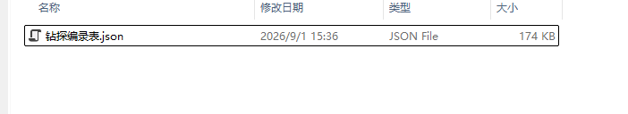
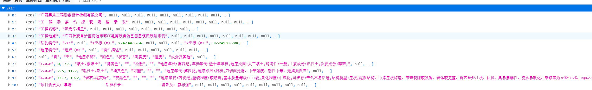

## 一、cad数据配置





路径结构如上，项目的数据转成json，保存在project目录下即可，插件会自动取目录下的数据。

## 二、钻探编录表转换方式

1、分成行和列的索引即可，例如：行是1，列是B，那么就代表：第0行，第1列，(Excel是从1行开始，列是从A开始， 对应JSON都是0行，0列开始)

2、Excel底部的“钻孔名称"为键key。

转换后的样式如下：



## 三、调用接口

插件会在本地开启：http://localhost:7100 端口

以下请求默认为POST方式

1、平面图

```
无
```

2、剖面图

```
无
```

3、柱状图

```
/ai/feature/create_column_view
请求体：“{}”
```

